If you have been around MEV-related circles at EthCC this summer, you may have heard many people coming to the conclusion that 'defining intents is easier, solving them is harder'. This is clearly wrong, as the two things are not independent: Defining what intents are determines how difficult solving them is. Indeed, it gives a very well known fact since at least the dawn of computer science that the more expressive a formal language is, the more difficult it is to decide statements - that is, to establish if a statement can or cannot be proved - in the corresponding mechanism recognizing the language; this concept is known as [Chomsky hierarchy](https://en.wikipedia.org/wiki/Chomsky_hierarchy). Indeed, if the language is really simple - e.g. you say that the only acceptable intents are transactions in the 'traditional' sense - then solving them is even simpler, since there is nothing to solve. So, a truer statement would be that 'as the expressivity of the intent language grows, so do grow the intellectual and computational burdens for the searchers that have to solve them.

...But what are intents, and what does it mean to solve them? I think it would be useful to define a formal framework to state this problem. Hopefully, this framework will also turn into something practically useful at some point. Again, if you were around EthCC this summer, you may also have stumbled into me saying that 'intents can be formalised with a mix of algebraic topology and general relativity'. Unfortunately, I was wrong, and what seems to do the job instead is a mix of topology together with my least favourite part of maths after number theory: Classical mechanics.

## What are intents?

### The recap for absolute dummies

**Since I'm talking to two different crowds, maths people that know nothing about crypto and crypto people that know very little mathematics, I'm going very slow. If you work in MEV-land just skip this part!**

In blockchain tech, you get things done via *transactions*. A transaction is, conceptually, nothing more than a way to change the blockchain state. For example, when you want to pay someone in crypto, you create a transaction that has the effect of decreasing your balance and increasing the balance of the payee accordingly.

Things become more complicated in blockchains like Ethereum, where you have *smart contracts* around. Here, transactions can call contract functions, so you can use transactions to, say, swap a number of tokens A for a suitable number of tokens B by calling some smart contract that does exactly this job.

...But *which* contract should you call? The problem is that there may be *many* ways to do so, e.g. there may be many different decentralised exchanges offering you different prices for the swap.
So, the problem for the user becomes: 'Say I have a goal, e.g. swapping some tokens. Which is the *best* way to do so? Which transaction should I come up with to get the best deal I can?'

### Intents, informally

Simply put, the idea of intents is that instead of specifying a transaction, you just specify a goal. You have a language to say 'I want to give away no more than $n$ tokens A and I want to receive no less than $m$ tokens B.' Then you, the *intent provider*, broadcast this statement to a network of *intent searchers*, which will compete to find the best transaction that does the job for you. So, intents are a way to offsource the problem of 'finding a way to satisfy a goal' to a bunch of other people, obviously for a fee.

### Intents, geometrically

To work towards a mathematical formalization of intent searching, we will adopt this slightly more involved point of view: When you, the intent provider, come up with an intent $\mathfrak{i}$, you specify (at least) a couple of points on some space, call them $s_0$ and $s_1$. An intent searcher $\mathfrak{s}$, in finding the transaction that satisfies $\mathfrak{i}$, does nothing but provide a transaction $s_0 \xrightarrow{t} s_1$. **So we reduced the problem of solving intents to a problem about finding paths in some space.** Clearly, there may be many different paths going from $s_0$ to $s_1$, so we'll also need a definition of 'best' path that the searcher can pick, or at least hope to approximate.

The entire goal of this blog post is to make this intuition formal.

## Formalizing intents

### The state space

First of all, we must formalise the concept of state space. Given some mechanism $G$, e.g. the Ethereum virtual machine, the *state space* has as *points* all the states in which the mechanism can be in. The *topology* on these points will be defined by the actions one can perform with the mechanism.

A simple, idealised representation of the state space is the one below, where the little squares are states, and two states are adjacent if you can go from one to the other via some atomic action. In Ethereum land, points would be the states of the EVM, and two points would be adjacent if there is some EVM trace bringing you from one state to the other:

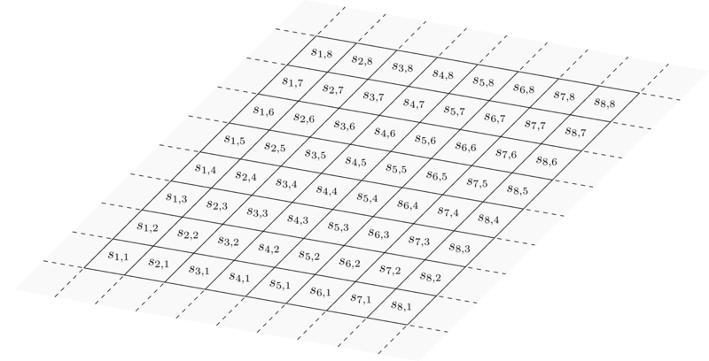

In practice, since we're mainly working with discrete mechanisms such as the EVM, the state space will never be so regular, and the following representation would be more appropriate: Given a mechanism $G$, we can build its [state diagram](https://en.wikipedia.org/wiki/State_diagram) when we see $G$ as some sort of automaton:

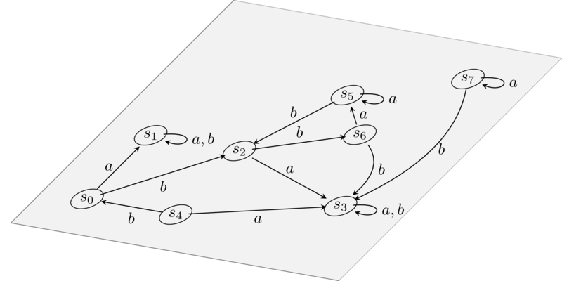

As you can see, the state diagram is actually a graph, where nodes are states, and edges, in the literature called *transitions*, are inputs that we feed to the automaton (in our case in the form of calldata) to get to another state. Modulo some differences in the transition decorations, this assumption is without loss of generality as every Turing machine admits a representation in terms of state diagrams, so any 'computationally feasible' mechanism $G$ will admit such a representation.

In the picture above we see the state diagram of a simple automaton that has nothing to do with blockchain infrastructure: In practice, the state diagram of something like the EVM is a monstruous, infinite graph, which is impossible to draw. 

In any case, we can work with what we got:

The *state space $S$ of a mechanism $G$* is the set of nodes of its state diagram.

Compared to the physical example above, we see that the state space $S$ for a mechanism $G$ has no real notion of continuity, differentiability or cohesion of any sort. It's just a set.

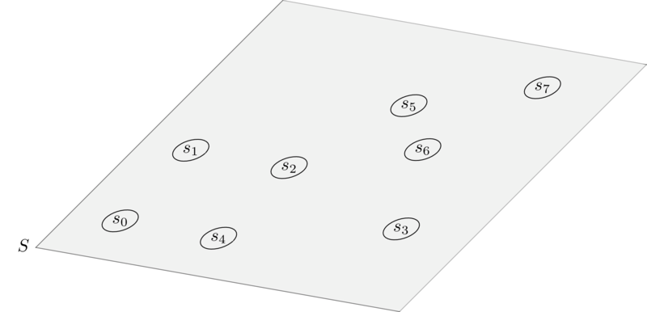

### Discretising tangent bundles

*Disclaimer: If you know differential geometry, you will be upset. In this section I'm deliberately identifying points in a smooth manifold with their generalised coordinates. I'm doing so because the alternative would be to talk about charts and all the like, which would make this blog post tremendously long and out of scope.*

Our main endeavor is trying to export techniques from Lagrangian mechanics to intentland. Lagrangians are very useful and versatile objects that describe the dyamics of physical systems. The first concepts one needs in describing a physical system are *positions* and *velocities*, and we need to define those in our setting to be able to define Lagrangians.

Positions are easy to understand: You have some notion of space $M$ (which in classical mechanics is very well behaved and is called a *smooth manifold*) and a position is nothing more than a point in it, call it $\mathbf{q}$. This we can easy port to our discretised setting: 

A *position* $\mathbf{q}$ is just an element of the state space $S$.

Velocities, on the other hand, are a bit harder. Given a representation of the physical space $M$, the velocity of a particle *at* a point represents a direction where the particle 'wants' to go while it stays in that point. Given $M$, at each point $\mathbf{q}$ we can build the *tangent space to $M$ at $\mathbf{q}$*, denoted with $T_\mathbf{q} M$. Velocities at point $\mathbf{q}$ are points in this space, and we denote them as $\mathbf{\dot{q}}$:

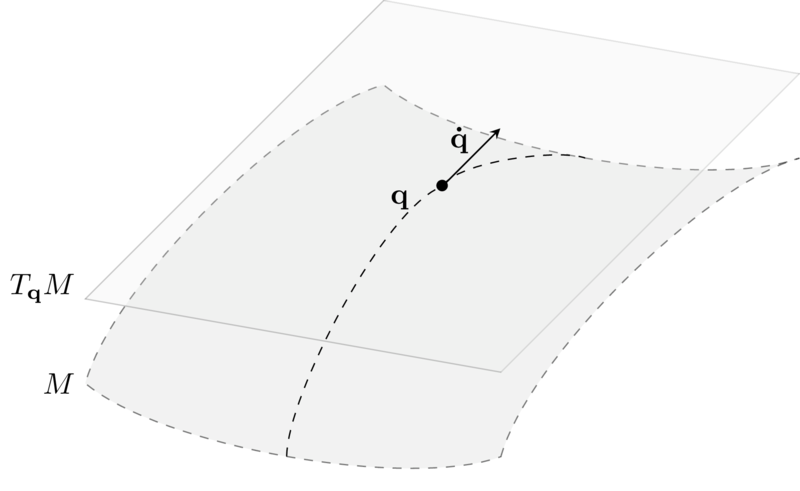

One can prove that when $M$ is a smooth manifold of dimension $n$, $T_\mathbf{q} M$ has the same dimension $n$ for each $\mathbf{q}$. I won't dwelve into the mathematical details of what this means. The take home message is that:

- If $M$ has dimension $n$, then you can represent any position in $M$ as $n$ coordinates: $\mathbf{q} := (q_1, \dots, q_n)$;
- Velocities at any point $\mathbf{q}$ can also be represented as $n$ coordinates: $\mathbf{\dot{q}} := (\dot{q}_1, \dots, \dot{q}_n)$.

We can put all these things together and define an object called *tangent bundle*, denoted $TM$, as follows:

$$ 
TM := \bigsqcup_{\mathbf{q} \in M} T_\mathbf{q} M = \bigcup_{\mathbf{q} \in M} \{\mathbf{q}\} \times T_\mathbf{q} M = \{ (\mathbf{q},\mathbf{\dot{q}} ) \mid \mathbf{q} \in M, \mathbf{\dot{q}} \in T_\mathbf{q} M\}
$$

Now, if $M$ has dimension $n$, one can see that $TM$ has dimension $2n$. As spelled above, a point in $TM$ is a couple $(\mathbf{q}, \mathbf{\dot{q}})$, and can be described by $2n$ coordinates: The first $n$ coordinates identify $\mathbf{q}$, the position; whereas the last $n$ coordinates identify the velocity $\mathbf{\dot{q}}$ at the position $\mathbf{q}$.

To apply Lagrangian techniques to our setting, we need to define an equivalent of velocities and tangent bundles for our sad, discrete state space $S$. This is no easy task, as the objects used in classical mechanics are incredibly much more well behaved with respect to the ones we have, but let's try.

As we said in the beginning, our state space $S$ is built out of a graph, the state diagram of our mechanism $G$. In particular, we used the nodes of this graph to build $S$. If intuitively velocities at a point represent 'where a particle wants to go', we can transfer this intuition right away to our case: Given a point $\mathbf{q}$ in our state space $S$, transitions starting at $\mathbf{q}$ represents 'where the state wants to go' when you apply them.

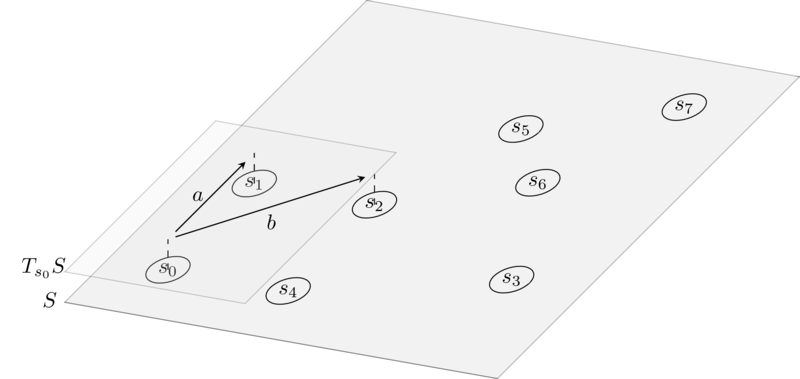

From this, we can define:

*Velocities* at $\mathbf{q}$, denoted $\mathbf{\dot{q}}$, are atomic transitions that start in $\mathbf{q}$.

The *tangent space* at $\mathbf{q}$ is defined as:

$$
T_\mathbf{q} S := \{\mathbf{\dot{q}} \mid \mathbf{q} \xrightarrow{\mathbf{\dot{q}}} - \}
$$

The *tangent bundle of the state space* is defined as:

$$
TS := \bigsqcup_{\mathbf{q} \in S} T_\mathbf{q} S = \{ (\mathbf{q},\mathbf{\dot{q}} ) \mid \mathbf{q} \in S, \mathbf{\dot{q}} \in T_\mathbf{q} S\}.
$$

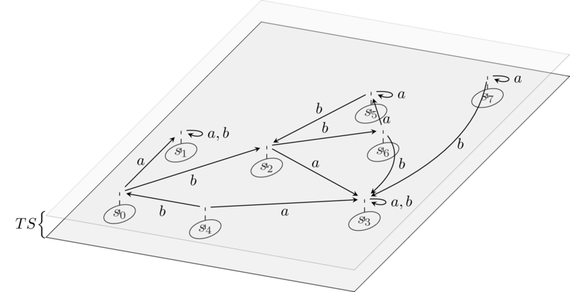

The *tangent bundle of the state space* is much coarser and uglier than the one used in physics. As stressed before, $TM$ has a lot of nice properties, can be described nicely using coordinates, etc; whereas $TS$ is just a set of couples $(\mathbf{q},\mathbf{\dot{q}})$ where the second component depends somehow on the first.

### Constraints (re)-define state space topology

Ok, now that we have a decent notion of space, suppose that an agent $\mathfrak{p}$ (intent proposer) creates an intent. The intent is composed, at the very least, of two *regions* of $S$, that is, of two sets of states: The first is the region identifying the *premises* of the intent (in green in the picture below), whereas the second is the region identifying the *conclusions* of the intent (in blue):

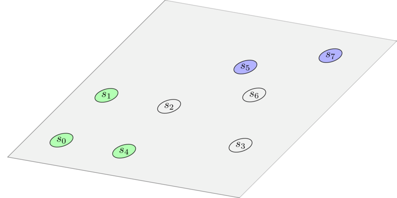

Why do we need regions and not just points, you may ask? The reason is that a point in the state space is a very granular description of what's going on: Say that the intent provided by $\mathfrak{p}$ is 'I want to swap $100$ tokens A for no less than $50$ tokens B.' A given point in the state space will also contain a lot of information regarding things that $\mathfrak{p}$ does not care about, such as the balance of other users $\mathfrak{p}' \neq \mathfrak{p}$ for which $\mathfrak{p}$ has no particular interest. As such, it is enough for us to consider *any* possible state where $\mathfrak{p}$ has $100$ tokens A as a viable starting point for a path 'solving' the intent. Indeed, in the example below the premises region is constituted by states where the balance of token A for the intent provider is always $100$. States in this region differ with respect to the balance (say, in Eth) of some other user $\mathfrak{p}'$. A similar reasoning holds for the conclusions region.

Now, depending on how expressive the language we use to define intents is, the intent provider $\mathfrak{p}$ may also express statements such as 'I don't want this particular smart contract to be used', or 'I want the token swap to be performed in this particular way'. This is where (algebraic) topology comes in: This is nothing more than identifying other regions of the state space in which either provider $\mathfrak{p}$ does not want the path to cross, or in which provider requires the path to pass. 
We won't focus on the latter type of constraints in this post, as it will be expressed naturally as we define how intents compose, which will be the content of a future blog entry. As for the former type of constraints, the 'I don't want the path to go here' ones , they can be taken care of by 'punching holes' in the state space, which in formal terms means *by changing the simply connectedness of the state space* (if only we were working with a real topological space). In the picture below, we colored the 'holes' in red for clarity. In practice, it is sufficient to strip these elements from the state space $S$.

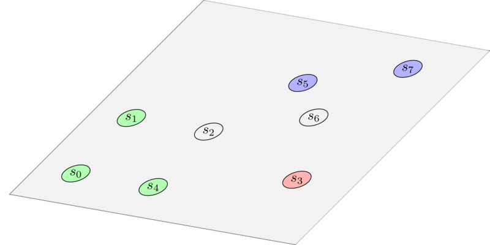

Further constraints clearly must be reflected on the structure of $TS$: If we 'disallow' some points in the state space $S$, then we also have to 'disallow' velocities that lead to those points. Elaborating on this further, we are quickly made aware of the fact that intents may also contain constraints that intervene purely on the $\mathbf{\dot{q}}$, that is, constraints that disallow using a given transition when in a given state. In general, we have to work with a restriction of the tangent bundle of the state space $TS$.

An *intent space* is a subset $T^i S \subseteq TS$ such that if $(\mathbf{q},\mathbf{\dot{q}}) \in T^\mathfrak{i} S$ and $\mathbf{q} \xrightarrow{\mathbf{\dot{q}}} \mathbf{q'}$, then $\mathbf{q'} \in \pi_1 (T^i S)$.

Here, $\pi_1: TS \to S$ is the projection on the first coordinate.
In words: If $(\mathbf{q},\mathbf{\dot{q}})$ is in the intent space and $\mathbf{\dot{q}}$ leads to $\mathbf{q'}$, then $\mathbf{q'}$ must be included in the intent space as well somehow. Finally, 

An *intent* $\mathfrak{i}$ is a triple $(T^\mathfrak{i} S, S^\mathfrak{i}_i, S^\mathfrak{i}_f)$ with $S^\mathfrak{i}_i, S^\mathfrak{i}_f \subseteq S$.

Here, $S^\mathfrak{i}_i, S^\mathfrak{i}_f$ represent the premises and conclusions regions of $\mathfrak{i}$, respectively.

## The solver's perspective

Now, we finally embrace the perspective of the intent solver, call it $\mathfrak{s}$: The solver must provide a path (we will formalise this concept shortly) that starts in the premises region $S_i$ and ends in the conclusions region $S_f$. But is every path on $T^\mathfrak{i} S$ satisfing this property enough to solve the intent? No! In fact, there may be paths that are crossing states where $\mathfrak{s}$ is not allowed to go for reasons that have nothing to do with the intent given by $\mathfrak{p}$, or that use transitions that may revert when sent by $\mathfrak{s}$.
An example of this is if $\mathfrak{s}$ tries to call a given smart contract function without having the necessary permmissions - e.g. because of an `onlyowner` modifier when $\mathfrak{s}$ is not the owner of the contract. 

So, we need to further refine $(T^\mathfrak{i} S, S^\mathfrak{i}_i, S^\mathfrak{i}_f)$ when taking the solver perspective: 

An *intent $\mathfrak{i}$ from the perspective of solver $\mathfrak{s}$* is a triple $(T^\mathfrak{i,s} S, S^\mathfrak{i,s}_i, S^\mathfrak{i,s}_f)$ where:
- $T^\mathfrak{i,s} S := T^\mathfrak{i} S \cap \lbrace$ regions of $T^\mathfrak{i} S$ where $\mathfrak{s}$ is allowed to go $\rbrace$;
- $S^\mathfrak{i,s}_i := S^\mathfrak{i}_i \cap \pi_1(T^\mathfrak{i,s} S)$;
- $S^\mathfrak{i,s}_f := S^\mathfrak{i}_f \cap \pi_1(T^\mathfrak{i,s} S)$.

In practice, $T^\mathfrak{i,s} S$ is just $T^\mathfrak{i} S$ where we punched even more holes, corresponding to states that cannot be reached by the solver $\mathfrak{s}$ and to the transitions that $\mathfrak{s}$ cannot use.

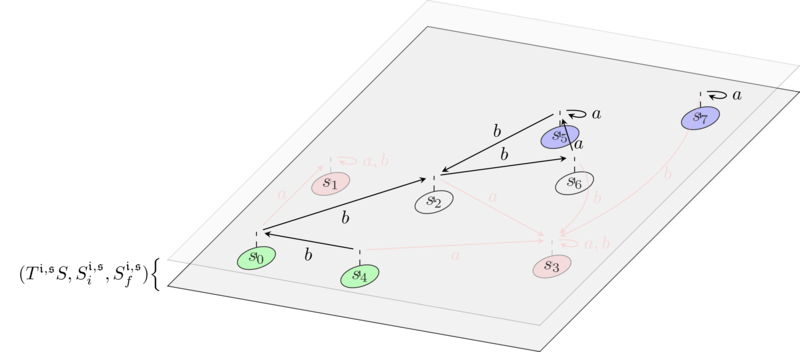

### Allowed paths

Ok, so now we have a solver $\mathfrak{s}$ and the intent space, suitably shaped by the provided intent. To solve the intent, $\mathfrak{s}$ wants to find a *path* in $T^\mathfrak{i,s} S$ that starts in $S^\mathfrak{i,p}_i$ and lands in $S^\mathfrak{i,p}_f$.

But what is a path really? Again, let's look at physics. In the nice, reassuring world of the well-behaved physical space $M$, it would be nothing more than a function $\mathbf{q} : \mathbb{R} \to M$, which expresses how the position $\mathbf{q}(t)$ in the space $M$ varies along with time $t$. Moreover, as this function is supposed to be infinitely derivable, we can *differentiate* it along $t$ and obtain its *velocity* $\mathbf{\dot{q}} := \frac{d\mathbf{q}}{dt}: \mathbb{R} \to T_{\mathbf{q}(t)} M$.

Unfortunately, in our case both the state space $S$ and 'time' are discrete quantities. A path is then defined as a sequence of states and transitions:

$$
s_0 \xrightarrow{t_0} s_1 \xrightarrow{t_1} \dots \xrightarrow{t_{n}} s_{n+1}.
$$

Equivalently, this can be spelled out as a couple of functions:

$$
\begin{gather*}
(\mathbf{q}(t), \mathbf{\dot{q}}(t)): \{0, \dots, n\} \to T^\mathfrak{i,p} S\\
i \mapsto (s_i,t_i)
\end{gather*}
$$

such that $s_i \xrightarrow{t_i} s_{i+1}$ for all $i$. 
Notice how we do not need to explicitly mention the state $s_{n+1}$, as this information is implicitly contained in the couple $(s_n,t_n)$. 

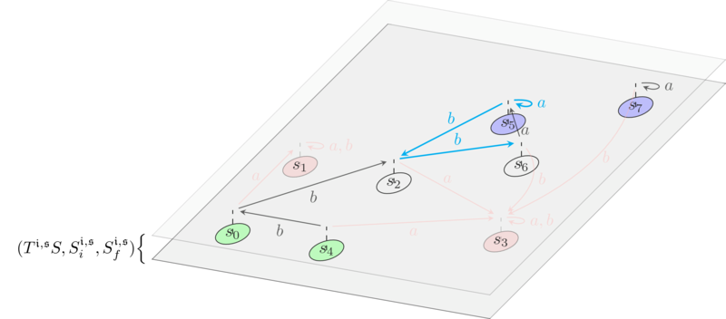

In stark contrast with physics, $\mathbf{\dot{q}}$ *cannot* be just determined from $\mathbf{q}$ since we do not have a notion of differentiation: There may very well be two different transitions $\mathbf{\dot{q}}, \mathbf{\dot{q}'}$ such that $\mathbf{q} \xrightarrow{\mathbf{\dot{q}}, \mathbf{\dot{q}'}} \mathbf{q'}$.

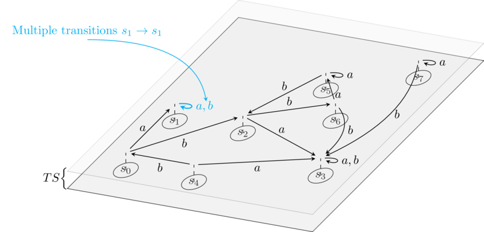

A path $(\mathbf{q}(i), \mathbf{\dot{q}}(i))_{0 \leq i \leq n}$ in $T^\mathfrak{i,p} S$ is *allowed* if $\mathbf{q}(0) \in S^\mathfrak{i,p}_i$ and $\mathbf{q}(n+1) \in S^\mathfrak{i,p}_f$.

Indeed, allowed paths represent *solutions* for the intent $\mathfrak{i}$ that are *feasible* for the solver $\mathfrak{s}$.

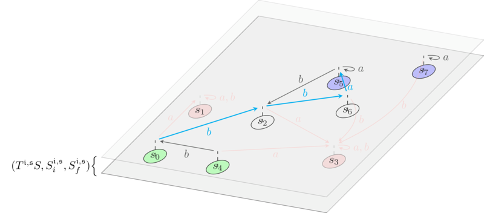

### Utilities as Lagrangians

So here we have it: $\mathfrak{p}$ provides an intent, and $\mathfrak{s}$ solves it by finding an allowed path. But clearly there may be many different allowed paths, that is, many different solutions of the intent that are feasible for $\mathfrak{s}$. So which one would $\mathfrak{s}$ pick? The 'best allowed path' selection is what brings *Lagrangian mechanics* into the picture, and the real reason why we did all the work so far.

In its general form, a *Lagrangian* on a configuration space $M$ is a real function 

$$
\mathcal{L}: TM \times \mathbb{R} \to \mathbb{R}
$$

such that $\mathcal{L}(\mathbf{q},\mathbf{\dot{q}},t)$ succintly summarises the overall dynamics of the system. In many interesting cases, the Lagrangian does not directly depend on time, and one just writes $\mathcal{L}(\mathbf{q},\mathbf{\dot{q}})$. The idea is that you feed it with a position $\mathbf{q}$, and with a velocity $\mathbf{\dot{q}}$ at $\mathbf{q}$, and it spits out a number that gives you information about the dynamical status of the system at that point. In many problems in classical mechanics, the Lagrangian is just taken to be: $\text{kinetic energy} - \text{potential energy}$, where the first quantity depends only on velocity and the second may depend on both velocity and position. In this case, this Lagrangian is giving us the 'level of energy balance' at the given point: It will be positive if at that point there is more kinetic energy than potential energy, and negative if the opposite happens. As motion in classical mechanics is often caused by the potential energy being converted to kinetic energy, we can see why such a quantity may be of importance.

In intentland we do not have energy, **but we have MEV**. The comparison is apt: In physics, work and energy are the same thing, so the amount of work performed on a physical system has the units of energy. Similarly, in cryptoeconomic mechanisms the work performed can be quantified by the amount of *extractable value* one can take from the system. We can define utility functions for $\mathfrak{s}$ on both states and transitions of a system:
- $\mathcal{U}^\mathfrak{s}: S \to \mathbb{R}$ quantifies the net utility that the solver $\mathfrak{s}$ has when the system is in a given state $\mathbf{q}$. This may correspond, for instance, to the aggregated token balance of $\mathfrak{s}$ at state $\mathbf{q}$. 
- Similarly, and overloading notation, $\mathcal{U}^\mathfrak{s}: T_\mathbf{q} S \to \mathbb{R}$, for each $\mathbf{q}$, quantifies the net utility that $\mathfrak{s}$ obtains in performing the transition $\mathbf{\dot{q}}$. This utility can, for instance, be negative, and quantifies externalities that come in performing the transition $\mathbf{\dot{q}}$ which aren't already accounted in the state.
With these ideas in mind, we can define a useful Lagrangian: 

The *free solver Lagrangian* $\mathcal{L}^\mathfrak{s}_{f}$ is given by:

$$
\mathcal{L}^\mathfrak{s}_{f}(\mathbf{q},\mathbf{\dot{q}}) = \mathcal{U}^\mathfrak{s}(\mathbf{\dot{q}}).
$$

This Lagrangian is the equivalent of the Lagrangian for the free particle in physics, which describes a system with no potential energy. This Lagrangian depends only on transitions (exactly as the free particle Lagrangian in physics depends only on velocities). It does not care about the utilities associated to the state, and as such, it represents the *selfless solver*: We will see shortly that the only thing this solver cares about here is to save on gas, but has no particular interest in preferring any given starting (ending) state for a path with respect to another, as long as the paths are allowed and they cost the same gas.

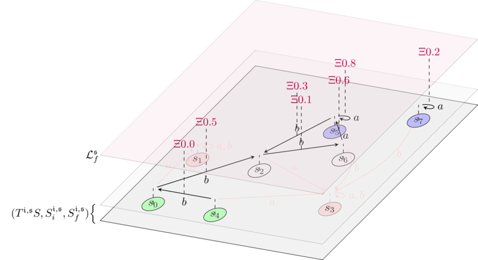

As a word of caution, finding the right Lagrangian that describes a physical system is an art, and I'm sure the same is true for intent solving. So, for sure, finding insightful Lagrangians is a topic in itself that is out of the scope of this post, but that we will very much investigate in the future.

### Principle of least action defines intent search

Now we're finally at the core of our model. Suppose you have a path in the physical space $\mathbf{q}(t): \mathbb{R} \to M$. For a Lagrangian $\mathcal{L}$, you can compute $\mathcal{L}(\mathbf{q}(t),\mathbf{\dot{q}}(t))$ for each time $t$ in a given interval $[t_0,t_1]$, and take the sum:

$$ 
\int_{t_0}^{t_1} \mathcal{L}(\mathbf{q}(t),\mathbf{\dot{q}}(t)) \delta t.
$$

This quantity is called *action*, and is a functional $\mathcal{A} : (\mathbb{R} \to M) \times \mathbb{R} \times \mathbb{R} \to \mathbb{R}$ (the notation in physics for the action is $S$, but we're using $\mathcal{A}$ here since we are already using $S$ for the state space). Given a path $\mathbf{q}: \mathbb{R} \to M$, $\mathcal{A}(\mathbf{q}, t_0, t_1)$ returns a scalar defined as above.

Notice that $\mathcal{A}$ does not depend explicitly on $\mathbf{\dot{q}}$ since, for any path $\mathbf{q}$, the velocity $\mathbf{\dot{q}}$ is obtained by differentiating with respect to time: $\mathbf{\dot{q}} = \frac{d\mathbf{q}}{dt}$. This is often a hard point to understand, so let's clarify: 
- On one hand, the Lagrangian is defined for *any* point $(\mathbf{q},\mathbf{\dot{q}})$ in $TM$, and $\mathbf{q}$ and $\mathbf{\dot{q}}$ can be totally independent from each other;
- On the other hand, when you have a path $\mathbf{q}: \mathbb{R} \to M$, you define a couple $(\mathbf{q}, \frac{d\mathbf{q}}{dt})$ where now the second component *does* depend on the first;
- By putting these points together, you can plug the couple $(\mathbf{q}, \frac{d\mathbf{q}}{dt})$ into $\mathcal{L}$, and obtain a functional that only depends on $\mathbf{q}$;
- So, whereas $\mathcal{L}$ depends on the whole space $TM$, $\mathcal{A}$ only depends on *paths* defined on $M$.

Physics says that, given $\mathcal{L}$ and times $t_0, t_1$, *the paths $[t_0, t_1] \to M$ describing the motion of our physical system are the stationary points of the action*, that is, the paths $\mathbf{q}$ such that 

$$
\frac{d\mathcal{A}(\mathbf{q}, t_0, t_1)}{d\mathbf{q}} = 0.
$$

In particular, in mechanical systems the equations of motion of the system are often given by the paths that *minimise* $\mathcal{A}$, so for the paths $\mathbf{q}(t)$ for which $\mathcal{A}(\mathbf{q}, t_0, t_1)$ is a (local) minimum. The meaning of this the following: At each point of $TM$, $\mathcal{L}$ gives us information about the energetic balance of the system at that point. Now imagine you have a path defined on the interval $[t_0, t_1]$. This path may be *non-physical*, e.g. a path where the trajectory changes direction even if it is not subjected to any force whatsoever. The 'forces' here are succintly embedded into the Lagrangian, since the presence of a force at a point will be accounted for in the overall energy balance given by $\mathcal{L}$ evaluated at that point. In this case, the paths that are *physical* are the ones that upset the energy balance defined by $\mathcal{L}$, along the path, as little as possible.

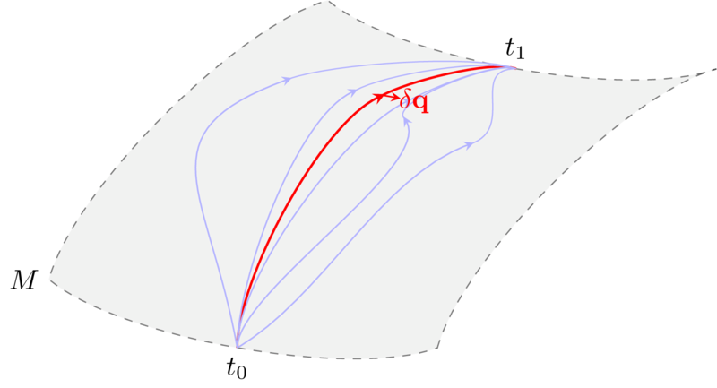

In layman terms: Physics is tacky, and the trajectories of objects in a physical systems are the ones that minimise $\mathcal{A}$: Every small variation $\delta \mathbf{q}$ of the path $\mathbf{q}$ minimizing $\mathcal{A}$ would be non-physical, since it would make $\mathcal{A}$ bigger.

In intentland, the lagrangian $\mathcal{L}^\mathfrak{s}$ defines the *utility balance* of $\mathfrak{s}$ at each point of $T^\mathfrak{i,p} S$, and our paths are discrete. If we have a path $(\mathbf{q}, \mathbf{\dot{q}}): [0,\dots,n] \to T^\mathfrak{i,p} S$, we define: 

The *action* for $\mathfrak{s}$ is:

$$
\mathcal{A}^\mathfrak{s}(\mathbf{q},\mathbf{\dot{q}}) := \sum_{i=0}^{n} \mathcal{L}^\mathfrak{s}(\mathbf{q}(i),\mathbf{\dot{q}}(i)).
$$

Notice that in our case $\mathcal{A}^\mathfrak{s}$ depends on both $\mathbf{q},\mathbf{\dot{q}}$ since the two come as a unique package in intentland: As we remarked above, in our discrete setting we cannot obtain $\mathbf{\dot{q}}$ from $\mathbf{q}$ as we do not have a notion of derivation. So, whereas a physical path is just defined as $\mathbf{q}$ (and we can compute its velocity $\mathbf{\dot{q}}$ by differentiating), we *defined* a path in intentland to *be* the couple $(\mathbf{q}, \mathbf{\dot{q}})$, and hence $\mathcal{A}^\mathfrak{s}$ depends on paths in perfect analogy with its physical counterpart, and has signature: 

$$
\mathcal{A}^\mathfrak{s} : \text{Allowed paths} \to \mathbb{R}.
$$

The *principle of least action for intents* then reads as follows: 

The *best* solutions for the intent $\mathfrak{i}$ that $\mathfrak{s}$ can provide are the paths that *minimise* the action $\mathcal{A}^\mathfrak{s}$, that is, the couples 

$$
(\mathbf{q}_{\text{best}},\mathbf{\dot{q}}_{\text{best}})
$$

such that:

$$
\mathcal{A}^\mathfrak{s}(\mathbf{q}_{\text{best}},\mathbf{\dot{q}}_{\text{best}}) = \min_{(\mathbf{q},\mathbf{\dot{q}}) \in \text{allowed paths}} \mathcal{A}^\mathfrak{s}(\mathbf{q},\mathbf{\dot{q}}).
$$

### Simple example: Action of the free searcher Lagrangian

Let us see what this means in practice for the free searcher Lagrangian. Given a path $(\mathbf{q},\mathbf{\dot{q}})$ and the free searcher Lagrangian $\mathcal{L}^\mathfrak{s}_{f}$,

$$
\begin{align*}
    \mathcal{A}^\mathfrak{s}(\mathbf{q},\mathbf{\dot{q}}) &:= \sum_{i=0}^{n} \mathcal{L}^\mathfrak{s}_{f}(\mathbf{q}(i),\mathbf{\dot{q}}(i))\\
    &= \sum_{i=0}^{n} \Big(\mathcal{U}^\mathfrak{s}(\mathbf{\dot{q}}(i)) \Big).
\end{align*}
$$

So, for instance, in a gasless axiomatization of the state space, and using $\mathcal{U}^\mathfrak{s}(\mathbf{\dot{q}}(i))$ to account for gas fees, a best solution for the intent $\mathfrak{i}$ under the free searcher Lagrangian $\mathcal{L}^\mathfrak{s}_{f}$ is any path that *minimises the gas cost of the solution*, precisely as we would expect.

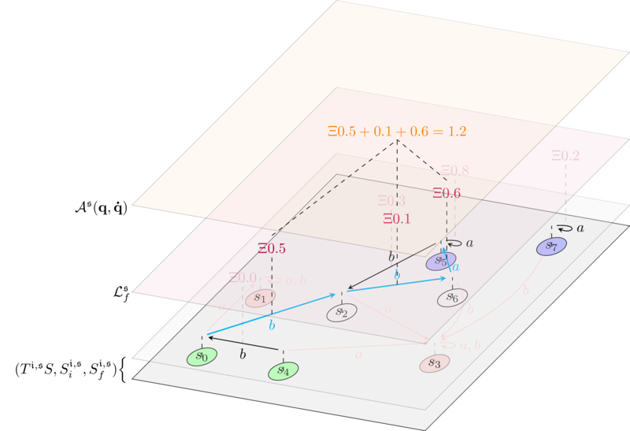

The fact that the searcher $\mathfrak{s}$ is considered *selfless* comes from the fact that $\mathfrak{s}$ is only trying to reduce gas costs, and is not interested in picking any particular starting state (ending state, respectively) in $S^\mathfrak{i,p}_i$ ($S^\mathfrak{i,p}_f$, respectively), as long as they give the least gas cost.

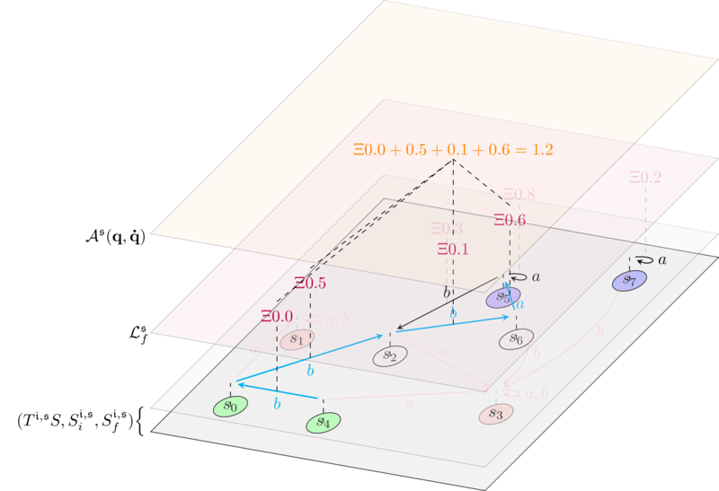

### Cheating physics

In physics, a Lagrangian $\mathcal{L}(\mathbf{q},\mathbf{\dot{q}})$ is *local*: What it means is that, when evaluated on a point in $TM$, it only tells us information about what happens in that point. This is obvious, as the point is everything the Lagrangian depends on. But in intentland things are different, and we can cheat!

Indeed, our definition of velocity is very different from the one of physics. In physics, a velocity $\mathbf{\dot{q}}$ at a point $\mathbf{q}$ represents an infinitesimal change in a given direction starting from $\mathbf{q}$. Since this change is infinitesimal in nature, it cannot bring us to any other point $\mathbf{\dot{q'}}$. This is radically different from what happens in our discrete setting: For us, velocities at $\mathbf{q}$ are atomic transitions $\mathbf{\dot{q}}$ that start at $\mathbf{q}$. By definition, we can just *apply* $\mathbf{\dot{q}}$ to $\mathbf{q}$ to end up in some other state $\mathbf{q'}$. As such, our notion of Lagrangian is intrinsically *non-local*: In practice, the dependence on $\mathbf{q},\mathbf{\dot{q}}$ is enough to operate also on the resulting state $\mathbf{q'}$. With this intuition in mind, we can define new Lagrangians:

The *greedy solver Lagrangian* $\mathcal{L}^\mathfrak{s}_{g}$ is given by:

$$
\mathcal{L}^\mathfrak{s}_{g}(\mathbf{q},\mathbf{\dot{q}}) = \mathcal{U}^\mathfrak{s}(\mathbf{q}) - \mathcal{U}^\mathfrak{s}(\mathbf{q'})
$$

Where $\mathbf{q'}$ is again $\mathbf{\dot{q}}$ applied to $\mathbf{q}$.

$\mathcal{L}^\mathfrak{s}_g(\mathbf{q},\mathbf{\dot{q}})$ measures the loss of utility in going from $\mathbf{q}$ to $\mathbf{q'}$. In contrast with $\mathcal{L}^\mathfrak{s}_f$, which is the intent analogous of only having kinetic energy around, $\mathcal{L}^\mathfrak{s}_g$ has the aspect of a pure potential: It depends on $\mathbf{\dot{q}}$ only insomuch to calculate the adjacent state $\mathbf{q'}$, but disregards the intrinsic externalities given by $\mathbf{\dot{q}}$ - the 'kinetic energy' - completely.

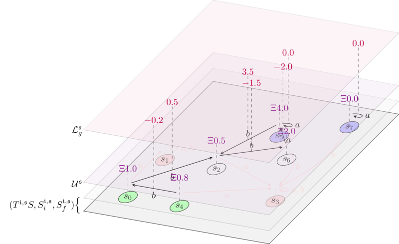

Above, we depicted a greedy solver Lagrangian. We annotated the states with their utilities (which are as in the example of the free Lagrangian), and annotated transitions with the corresponding loss delta.

The action of this Lagrangian on an allowed path is:

$$
\begin{align*}
    \mathcal{A}^\mathfrak{s}(\mathbf{q},\mathbf{\dot{q}}) &:= \sum_{i=0}^{n} \mathcal{L}^\mathfrak{s}_{g}(\mathbf{q}(i),\mathbf{\dot{q}}(i))\\
    & = \sum_{i=0}^{n} \Big( \mathcal{U}^\mathfrak{s}(\mathbf{q}(i)) - \mathcal{U}^\mathfrak{s}(\mathbf{q}(i+1))\Big)\\
    &= \mathcal{U}^\mathfrak{s}(\mathbf{q}(0)) - \mathcal{U}^\mathfrak{s}(\mathbf{q}(n+1))
\end{align*}
$$

So the action measures the net utility loss in walking a given path. The principle of least action applied to $\mathcal{L}^\mathfrak{s}_{g}$ says that the 'best' allowed paths are the ones minimizing the solver's utility loss. So, the greedy Lagrangian represents a solver that is maximally greedy: Given an intent, $\mathfrak{s}$ will pick the solution that is most convenient for its own pocket.

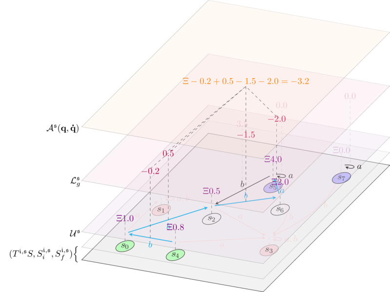

In particular, if it is $\min_{(\mathbf{q},\mathbf{\dot{q}}) \in \text{allowed paths}} \mathcal{A}^\mathfrak{s}(\mathbf{q},\mathbf{\dot{q}}) < 0$, then the best paths have negative loss (and so positive profit, as depicted in the figure above), and indentify intent solutions that $\mathfrak{s}$ has an *incentive* to produce.

We conclude by putting things together:

The *weighted greedy Lagrangian* $\mathcal{L}^\mathfrak{s}_{w}$ is given by:

$$
\mathcal{L}^\mathfrak{s}_{w}(\mathbf{q},\mathbf{\dot{q}}) = \mathcal{U}^\mathfrak{s}(\mathbf{\dot{q}}) + \big(\mathcal{U}^\mathfrak{s}(\mathbf{q}) - \mathcal{U}^\mathfrak{s}(\mathbf{q'})\big)
$$

Where $\mathbf{q'}$ is again $\mathbf{\dot{q}}$ applied to $\mathbf{q}$. Trivially, $\mathcal{L}^\mathfrak{s}_w = \mathcal{L}^\mathfrak{s}_f + \mathcal{L}^\mathfrak{s}_g$. This is the intent counterpart of the usual $\text{kinetic energy} - \text{potential energy}$ Lagrangian in classical mechanics. It measures both the intrinsic loss in going from $\mathbf{q}$ to $\mathbf{q'}$ - the 'potential energy' - *and* the extrinsic cost of of the transition $\mathbf{\dot{q}}$ - the 'kinetic energy'. Computing the action, we have:

$$
\begin{align*}
    \mathcal{A}^\mathfrak{s}(\mathbf{q},\mathbf{\dot{q}}) &:= \sum_{i=0}^{n} \mathcal{L}^\mathfrak{s}_{w}(\mathbf{q}(i),\mathbf{\dot{q}}(i))\\
    &= \sum_{i=0}^{n} \Big( \mathcal{U}^\mathfrak{s}(\mathbf{\dot{q}}(i)) + \big(\mathcal{U}^\mathfrak{s}(\mathbf{q}(i)) - \mathcal{U}^\mathfrak{s}(\mathbf{q}(i+1))\big)\Big)\\
    &= \sum_{i=0}^{n} \Big(\mathcal{U}^\mathfrak{s}(\mathbf{\dot{q}}(i))\Big) + \mathcal{U}^\mathfrak{s}(\mathbf{q}(0)) - \mathcal{U}^\mathfrak{s}(\mathbf{q}(n+1)).
\end{align*}
$$

The principle of least action applied to $\mathcal{L}^\mathfrak{s}_{w}$ says that the 'best' solutions for the intent $\mathfrak{i}$ are the paths that minimise the loss *where the externalities of transitions are accounted for*.

In general, the intuition about Lagrangian mechanics applied to intents is that:
- The requirements of the intent can be encoded in the structure of the space.
- The behavior of the searcher (greedy, welfare maximizing, etc.) can be encoded in the Lagrangian.

## Conclusion

This post is a first attempt at formalizing intent production and search, heavily borrowing from second year undergrad physics. There are still many open questions about this approach:
- Working out intent composition. This should be relatively easy and you can expect another post coming out 'soon-ish'.
- Working out the equivalent of the Euler-Lagrange equations in our setting. Not sure this is even doable, but if it is, it's a big deal because it opens up a really good avenue towards intent solving.
- Working out more precisely how intent formulation changes the shape of the intent space. Unlikely to happen before people settle on what kind of languages they want to use for intents.

If you liked this post (or not) and you want to give me some feedback, shoot me an email or engage in public conversation on [Twitter](https://twitter.com/fabgenovese) or preferrably on [Mastodon](https://cryptodon.lol/@fab).