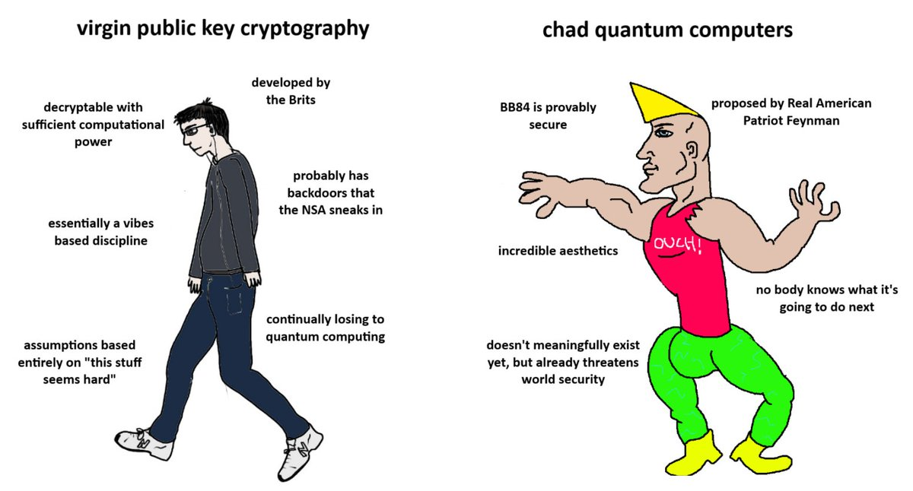
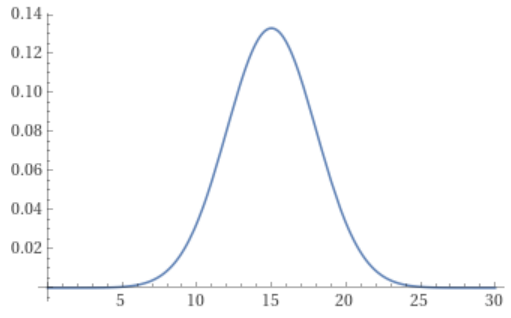
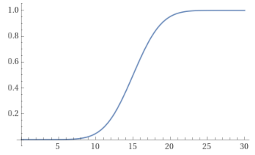

I've never made a secret of the fact that the level of preparedness of blockchain technology when it comes to quantum resistance frightens me. In this post, I'll try to economically quantify *how fucked are we* in this respect. Since we've been mainly involved with the Ethereum ecosystem, I'll start from there, also in light of Vitalik's [recent declarations](https://ethresear.ch/t/how-to-hard-fork-to-save-most-users-funds-in-a-quantum-emergency/18901) around making Ethereum quantum resistant.

First of all, we need to draw some distinctions, and in this matter I find it useful to begin by introducing a couple of definitions.

> There are two types of quantum events that are relevant for this post:
> - **Q-day**, intended as the time where it is first proven - for example in a lab - that a Quantum computer has the capabilities of breaking an existing, used cryptographic scheme.
> - **The Fuckening**, that is when quantum tecnology is effectively used *in the wild* to break some cryptographic scheme on a blockchain.

I think a great deal of disagreement about 'when we will be fucked' comes from ambiguity around the two definitions above. Given that access to quantum computing technology is not and will not be particularly easy for quite some time - one needs to know how to write quantum algos, how to run them, where to run them, etc. etc. - we can speculate that Q-day and the Fuckening will not happen at the same time. 

Q-day will probably first appear on some academic publication, and it's safe to assume that its authors and editors will willingly make these results difficult to reproduce to avoid a global catastrophe.
This in turn means that an uncrupoulous actor will probably have to put in some extra effort to reproduce, specialize and run these results in a malicious way. Most likely, Q-day will cause a panic among experts, but the Fuckening is what will ultimately cause a mass panic among blockchain users.

It is also reasonable to assume that the Fuckening won't target Ethereum first. It will probably not even target blockchain systems at first, but other financial or military infrastructure. As for blockchain tech, if I were to wreck the ecosystem completely, I'd do it with style, for example by breaking one of the well-known [Satoshi wallets](https://www.blockchain.com/explorer/addresses/btc/1A1zP1eP5QGefi2DMPTfTL5SLmv7DivfNa). Yet, such an event will immediately work as proof that *all* blockchains that aren't immediately quantum resistant are fuckened, and the mass panic will spread like wildfire to all ecosystems that aren't explicitly quantum resistant.

In light of this, and for the sake of simplicity, we will assume that:

$$
\begin{align*}
\exists b \in &\text{blockchain} . (\neg\text{quantum resistant}(b) \wedge \text{fuckened}(b))\vdash\\
&\vdash \forall b' \in \text{blockchain}.\neg\text{quantum resistant}(b') \to \text{fuckened}(b')
\end{align*}
$$

In words:

> All quantum weak chains will be doomed as soon as the first quantum weak chain is successfully broken. 
 
So, for instance, we can consider 'a Bitcoin wallet is broken by a quantum attack' as effectively breaking Ethereum too, if Ethereum is still not quantum resistant by then.

## Playing with probabilities
In a [recent post](https://twitter.com/VitalikButerin/status/1787884546790220258) Vitalik declared that he believes the timeline for Q-day is between 10 and 20 years. Personally I disagree, and I would set 10 years as the maximum amount of time until Q-day that is safe to assume. This is for several reasons, among which the fact that [Moore's Law](https://en.wikipedia.org/wiki/Moore%27s_law) seems to be holding for quantum computers both in terms of [Neven's law](https://en.wikipedia.org/wiki/Hartmut_Neven#Neven's_Law) and of [quantum volume](https://en.wikipedia.org/wiki/Quantum_volume), and the fact that resource estimates for Q-day keep being made closer in [peer reviewed estimates](https://arxiv.org/abs/2306.08585). 

Yet, for the sake of the argument in this post I will assume Vitalik's estimate and try to conjure a mathematical interpretation to attach to his prediction. I deem it useful because calculations allow us to ponder where a given set of beliefs takes us, and to put a cost on predictions. For various reasons, this will not be a reliable model, so take it with a grain of salt: We're basically pretending to be wizards pondering a crystal orb that predicts the future by showing us probability distributions of a given event happening.

To crunch some numbers out of this, I will make assumptions that may or may not make sense to you, and it's important to make them clear from the start:

>1. I will assume that it is highly unlikely - but still possible -  that Q-day will happen before 10 years from now or later than 20 years from now.
>2. I will assume that the peak likelihood of Q-day happening will be in 15 years from now. This choice is pretty arbitrary but it sits right in the middle of Vitalik's specified interval.
>3. For the sake of mathematical beauty and convenience in representation, I will assume the probability distribution describing the likelyhood of Q-day to be continuous.

A reasonable way to mathematically formalize these assumptions is the following:

> I will assume that the probability of Q-day happening *precisely* at time $t$ years from now is a normal distribution of mean 15 and standard deviation 3.
> 
>$$
>f(t) := \frac{1}{3 \sqrt{2\pi}} e^{-\frac{1}{2}\left( \frac{t - 15}{3} \right)^2}
>$$
>
>

Since we cannot really clearly pinpoint how narrow this time window is, I just assumed 3 standard deviations which is quite high, but I like how the probability picks up speed inside the 10-20 years interval and becomes rapidly negligible outside of it, which seems to be reasonably compatible with Vitalik's assumption.

The distribution above gives us the probability of Q-day happening at a precise point in time. Now we ask: what is the *cumulative* probability that Q-day will happen within a time window that goes from now to some date $t$? For this we do not need any more assumptions. We just need to apply maths:

> The function that expresses the probability of Q-day happening *whithin* now and $t$ years from now is:
>
>$$
>\Phi(t) := \frac{1}{2}\left(1 + \text{erf}\left(\frac{t - 15}{3 \sqrt{2}} \right) \right)
>$$
>
>

Now, we evaluate $\Phi$ at 5, obtaining $0.000429060 \dots$. This is the probability of Q-day happening any time within the next 5 years. As for the probability of the Fuckening happening within the next 5 years:

> I will assume that up to a year needs to pass between when Q-day is first demonstrated and the Fuckening proper. 
 
This means that for the Fuckening happening within 5 years, Q-day must happen within 4 years. Evaluating the function above at 4 gives us $0.000122866\dots$.

These probabilities are very low, as we expected. But how can we put a price on these values?

### A risk breakdown

Ethereum's current market cap is around 350 billion dollars. Let's continue our thought experiment by assuming we are assessing risk in terms of *expected value* (and let's put aside the question whether this is a good thing to do for a possibly catastrophic event). Let's also suppose that:

>1. This market cap won't vary in the next 30 years;
>2. That in case of a quantum attack the value of the chain goes to 0.

Assumption 1. is a *very* unlikely assumption, but in my opinion a harmless one as long as it leads to a conservative estimate. I think this assumption is harmless because if on one hand it is true that Ethereum price tends to fluctuate over the years, it is also true that its 5-year average went up so far. Moreover, we are not considering the immense ecosystem of tokens, NFTs, DeFi, rollups, L2s, etc. piggybacking on Ethereum's security. All this will also be obliterated by a Fuckening of Ethereum, hence considering only Ether's market cap is a very conservative estimate of what we stand to lose.

As for 2. this is again probably not exact, but a reasonable estimate in practice as no one likes hopelessly broken tech.

> Under these assumptions, the cost of the Fuckening for Ethereum is *at least* 350B\\$. Playing the same game as above, and multiplying this with the probability of the Fuckening happening within 5 years, this means that in the next 5 years from now the cost of the Fuckening for Ethereum is, 'on average',
>
>$$0.000122866389 \cdot 350,000,000,000\$ \simeq 43,003,236\$. $$
>
>Similarly, Bitcoin stands to lose $\simeq 147,780,311$ dollars within the next five years.
>As for Solana, this cost is $\simeq 7,947,308\\$$.

These back of the envelope calculations give a clear, *conservative* budget indication. In the case of Ethereum, unless we are particularly risk-loving spending anything less than 43 million dollars in the next five years on the quantum hardening of the Ethereum ecosystem is a pretty good bet.

We could even get a finer sampling of $\Phi$ and get a monthly or yearly balance for the quantum hardening of Ethereum, if we like:

| Year | Cumulative Probability | Cumulative Expenditure |
|-----|-------------|---------------|
| 1 | $2.86 \cdot 10^{-7}$   | $100,100\$ $ |
| 2 | $1.5 \cdot  10^{-6}$    | $525,000\$ $ |
| 3 | $7.3 \cdot  10^{-6}$    | $2,555,000\$ $ |
| 4 | $0.0000316 \dots$  | $11,084,934\$ $ |
| 5 | $0.000122  \dots$  | $43,003,236\$ $ |

## Measures in place

One could argue that, in case of a quantum attack to Ethereum, the value of the chain would not go to zero. As Vitalik [suggested](https://ethresear.ch/t/how-to-hard-fork-to-save-most-users-funds-in-a-quantum-emergency/18901), we could basically roll back and hard fork the chain up until the attack, thus saving users' funds. This de-facto entails 'freezing' Ethereum until we find and successfully deploy a solution. I do not think this is a viable plan for a  simple reason: Ethereum uses a lot of different cryptographic primitives that are quantum weak. The most prominent ones are the schemes used to sign transactions, which if broken would allow an attacker to spend other people's funds. But we also have all sorts of elliptic curve cryptography employed at consensus and execution level: Think about validator signatures, [KGZ](https://en.wikipedia.org/wiki/Commitment_scheme#KZG_commitment) and [Pedersen](https://en.wikipedia.org/wiki/Commitment_scheme#A_perfectly_binding_scheme_based_on_the_discrete_log_problem_and_beyond) commitment schemes, and many of the most common ZK-SNARK schemes. All this stuff is quantum weak, and will have to be replaced.

This, in turn, means that the chain will have to possibly stay paused for an extended period of time until things are finally figured out. I think it is naïve to postulate that Ethereum value will stay fixed when the chain is frozen. By then we will probably have Ethereum ETFs approved, and other derivatives built on top of them. It is also not necessarily obvious that CEXes will suspend trading ETH pairs: all in all, Ethereum is part of a broader, complex ecosystem, and its value will not depend just on what happens on DEXes or on the fact that funds can actually be moved on-chain.

So the price of ETH may very well keep fluctuating, and given the dire situation it is overwhelmingly likely that it will move downwards as if the chain was never frozen. In the beginning I thought about modelling this mathematically as an exponentially decreasing function of type $\beta e^{-\alpha t}$, as it is proper of many physical dampening phenomena, but then I realized there's no real need. In the end, after a few months hodlers will still find themselves hodling a worthless asset.

Even worse, if the attack does not happen on Ethereum first, but for example on Bitcoin as we postulated in the beginning, we wouldn't even have an objective reason to freeze the chain, making the crash even worse.

## What we should do

As I said in the post opening, I am a bit scared. These are all conservative estimates. We stand to lose a lot and there are decisions that could be made 'right here, right now' that would make our life much easier in the future.

For instance, we could be prioritizing research that is quantum-resistant by default instead of keep pushing with developing cryptographic schemes that come with an inevitably short-ish shelf life. I do not understand why so many researchers are keen on building technical debt, considering that in many cases - such as the usage of [Verkle tries](https://verkle.info/) as Ethereum state witnesses - we are talking about technology that isn't being used in production yet. We have the possibility of pushing for a solution that is quantum resistant from day 1, and we saw with a couple of back-of-the-envelope calculations how the overhead to do all this, in the next 5 years, is only about 43 million dollars, arguably less than several funding rounds that happened in crypto in the last year alone.

Personally, I'm part of a [project](https://github.com/The-QSig-Commission/QSigCommissionWiki/wiki) that tackles quantum treats from a very different, active perspective, and I have nothing to gain in pushing a quantum hardening narrative if not just the fact that I'd like the ecosystem I work in and like so much to survive.

To conclude, as we sit at the blurry edge of an likely impending catastrophe, I want to ask: Can we start seriously planning ahead?

In the future, if anyone is interested, we will probably publish a post modelling the probability-weighted cost of a quantum attack *from first principles*, instead of doing that from Vitalik's beliefs. This should give us a more informed, grounded breakdown of the costs. Stay tuned!